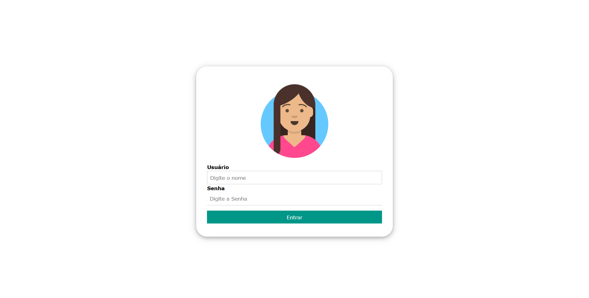

# Projeto Lista de Amigos com Sistema de Login (CRUD)

> Trabalho prático desenvolvido para a disciplina de Programação Web II (Curso Técnico em Desenvolvimento de Sistemas).

## 📋 Sobre o Projeto

Este projeto consiste num sistema web desenvolvido em **PHP** e **MySQL** que implementa uma aplicação **CRUD** (Create, Read, Update, Delete) para gestão de uma lista de amigos, complementada com um **módulo robusto de autenticação, controlo de sessões e segurança de rotas**.

O objetivo principal desta evolução foi aplicar boas práticas de desenvolvimento web, tais como a modularização de código, a segurança contra acessos diretos via URL e a centralização de conexões à base de dados.



---

## 🚀 Funcionalidades Principais

* **Autenticação de Utilizadores**: login integrado com validação de credenciais consultadas diretamente na base de dados.
* **Gestão de Sessões (`$_SESSION`)**: controle de estado do utilizador logado para impedir o acesso não autorizado às páginas principais através da barra de endereços (proteção de rotas).
* **Segurança e Tratamento de Erros**:
  * Redirecionamento automático para uma página de **Acesso Negado** caso o utilizador tente navegar sem autenticação prévia.
  * Funcionalidade de *Logout* que limpa as variáveis de sessão ativas e retorna ao ecrã inicial.
* **Modularização com PHP**: Utilização de funções de inclusão de arquivos (`require_once`) para padronizar cabeçalhos, rodapés e as credenciais de ligação à base de dados (`conexaoBD.php`), evitando redundância de código.

---

## 🛠️ Tecnologias e Ferramentas Utilizadas

* **Linguagem Backend**: PHP
* **Base de Dados**: MySQL
* **Frontend**: HTML5, CSS3, W3.CSS

---

## 📂 Estrutura de Ficheiros do Projeto

Abaixo encontra-se a organização dos principais ficheiros que compõem o sistema:

| Ficheiro | Descrição |
| :--- | :--- |
| `index.php` | Página inicial que apresenta o formulário de login do sistema[cite: 3]. |
| `loginAction.php` | Processa os dados do formulário, valida o utilizador na base de dados e inicia a sessão[cite: 3]. |
| `verificarAcesso.php` | Script de segurança incluído nas páginas protegidas para verificar se o utilizador está autenticado[cite: 3]. |
| `acessoNegado.php` | Página exibida caso ocorra uma tentativa de bypass ou acesso sem login[cite: 3]. |
| `principal.php` | Painel de controlo central após o login bem-sucedido (com opções de adicionar e listar)[cite: 3]. |
| `logoutAction.php` | Encerra a sessão ativa e redireciona o utilizador para o ecrã de login[cite: 3]. |
| `conexaoBD.php` | Ficheiro centralizado responsável pela conexão com a base de dados via MySQLi[cite: 3]. |
| `cabecalho.php` / `rodape.php` | Componentes reutilizáveis de layout da aplicação[cite: 3]. |

---

## ⚙️ Como Executar o Projeto Localmente

1. **Pré-requisitos**: Certifique-se de ter um servidor local em execução que suporte PHP e MySQL (como o USBWebserver, XAMPP ou WampServer).
2. **Clonar o Repositório**:
   ```bash
   git clone [https://github.com/hugoarcanjodev/etec-crud-login.git](https://github.com/hugoarcanjodev/etec-crud-login.git)
3. **Criar base de dados `pwii` e tabela `usuario`**:
    ```sql
    CREATE TABLE `pwii`.`usuario` (
      `idusuario` INT NOT NULL AUTO_INCREMENT,
      `nome` VARCHAR(45) NOT NULL,
      `senha` VARCHAR(100) NOT NULL,
      PRIMARY KEY (`idusuario`)
    );

    INSERT INTO `pwii`.`usuario` (`nome`, `senha`) 
    VALUES ('gabi', 'gabi123');
    ```